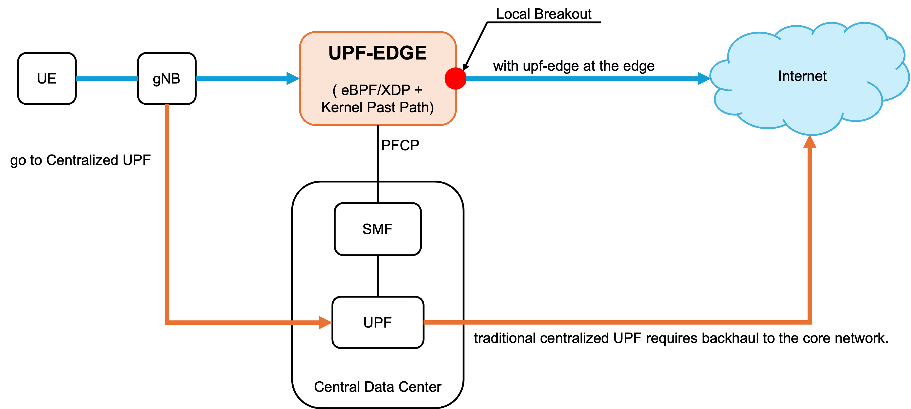
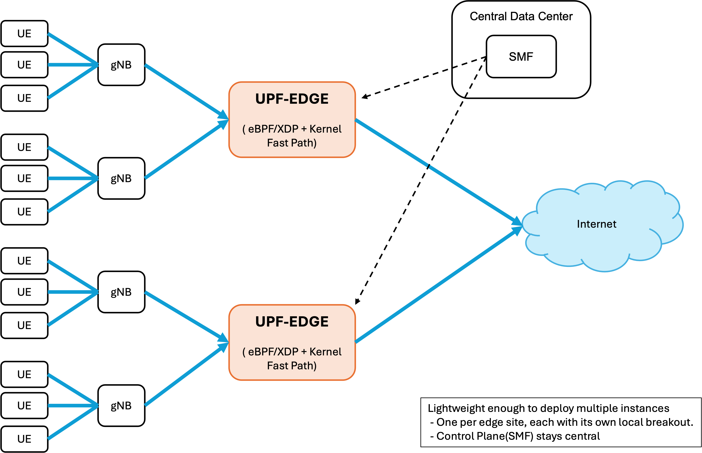
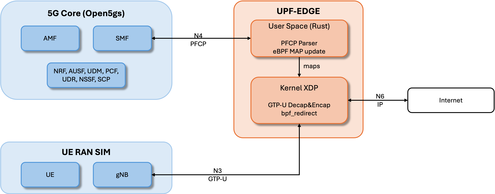
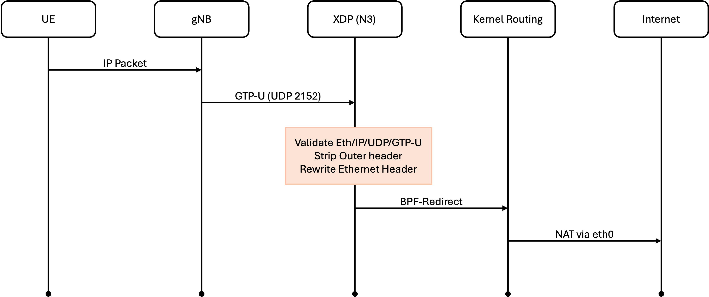
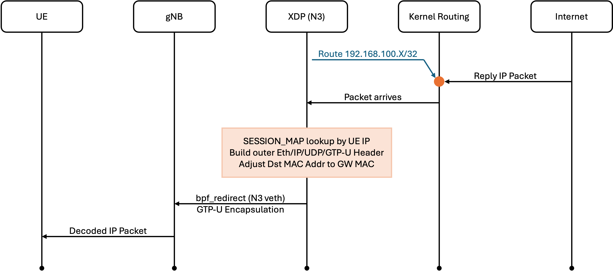

# upf-edge

> A Rust + eBPF/XDP implementation of the 5G User Plane Function (UPF) data plane,
> interoperating with Open5GS and UERANSIM.

`upf-edge` accelerates 5G UPF packet processing entirely in the kernel via XDP.
The control plane (PFCP message handling, session state) runs in Rust userspace
and pushes forwarding state into eBPF maps; the kernel does GTP-U
decap/encap, session lookup, and `bpf_redirect` at near line rate.

**Status:** Phase 2 complete — full bidirectional ping from a 5G UE through
`upf-edge` to the public internet, with PFCP control-plane integration to
Open5GS SMF.

---

## Why upf-edge?

5G CUPS (Control / User Plane Separation) lets the user-plane function
be deployed independently from the control plane. `upf-edge` is built to
take that role at the **edge** — small enough to live close to the gNB,
fast enough to push line-rate via eBPF/XDP, and configured by a single
TOML file so the same binary boots on any Linux host.

### Local breakout: a shorter data path



- **Blue path (with upf-edge)** — UE traffic exits to the Internet at the
  edge, just one hop past the gNB. Round-trip latency stays in the
  single-digit millisecond range.
- **Orange path (centralized UPF)** — every UE packet rides the operator
  backhaul to a central UPF before reaching the Internet. The backhaul
  adds 10s of milliseconds and consumes capacity for traffic that has
  no business going to the core.

The control plane (SMF) stays central and programs upf-edge over PFCP/N4.
Signaling is low-bandwidth and infrequent, so it tolerates the WAN just
fine.

### Edge-distributable



The whole runtime is a single Rust binary plus one TOML file. Operators
can scale out by placing one `upf-edge` per edge site, each serving its
own group of gNBs and breaking out locally. A central SMF configures
all of them over the same PFCP/N4 interface — exactly what 5G CUPS
was designed to enable.

### At a glance

|                                  | Centralized UPF                 | upf-edge                              |
|----------------------------------|---------------------------------|---------------------------------------|
| **UE → Internet latency**        | gNB → backhaul → central UPF  ≈ 10–100 ms (backhaul)   | gNB → local upf-edge → Internet  ≈ 1–5 ms (local)      |
| **Per-packet data plane**        | Userspace, context-switch heavy | eBPF/XDP, fully in-kernel             |
| **Deployment unit**              | Heavy (full 5G stack node)      | Single Rust binary + TOML config      |
| **Where it can run**             | Operator data center            | Any Linux host (see [Configuration](#configuration)) |
| **Control plane location**       | Same site as the data plane     | Anywhere — SMF stays central via PFCP/N4 |

---


## Table of contents

- [Demo](#demo)
- [Architecture](#architecture)
- [Data plane flow](#data-plane-flow)
- [What's implemented](#whats-implemented)
- [What's out of scope](#whats-out-of-scope)
- [Prerequisites](#prerequisites)
- [Quick start](#quick-start)
- [Detailed setup](#detailed-setup)
- [Configuration](#configuration)
- [Testing with smf-sim](#testing-with-smf-sim)
- [Project structure](#project-structure)
- [eBPF maps](#ebpf-maps)
- [Troubleshooting](#troubleshooting)
- [Roadmap](#roadmap)
- [References](#references)

---

## Demo

### PFCP control plane (smf-sim driving upf-edge)

https://github.com/user-attachments/assets/5aaed25f-9859-433c-8eb1-6c62de8b8567

End-to-end PFCP cycle without Open5GS:
`add session 1` → both sides show the session →
`del session 0x01` → both sides confirm removal.

### Full 5G data plane (Open5GS + UERANSIM)

https://github.com/user-attachments/assets/b1f8b01f-fe4f-414a-8b4b-46dc34393eb0

upf-edge running with Open5GS SMF + UERANSIM gNB and UE.
The UE attaches, a PDU session is established via PFCP,
and `ping 8.8.8.8` works end-to-end through the eBPF data plane.

---

## Architecture

`upf-edge` replaces the data-plane component of an Open5GS deployment. The 5G
core (AMF, SMF, AUSF, UDM, NRF, PCF, etc.) and the simulated RAN (UERANSIM gNB
and UE) remain untouched.



Interfaces handled:

| Interface | Protocol | Direction | Implemented by |
|---|---|---|---|
| **N3** | GTP-U / UDP 2152 | gNB ↔ UPF | XDP (decap + redirect) |
| **N4** | PFCP / UDP 8805 | SMF ↔ UPF | Userspace |
| **N6** | Plain IP | UPF ↔ DN | Kernel routing + NAT |

---

## Data plane flow

Two XDP entry points: `upf_edge_n3` on the gNB-side veth, `upf_edge_n6` on
`upfedge0`.

### Uplink: UE → Internet



### Downlink: Internet → UE



The downlink path was the hardest part of Phase 2 — see
[`docs/PFCP_NOTES.md`](docs/PFCP_NOTES.md) for the bugs that
showed up between "encap function gets called" and "ping reply arrives at UE".

---

## What's implemented

| Component | Status |
|---|---|
| GTP-U decapsulation (uplink) | ✅ |
| GTP-U encapsulation (downlink) with PDU Session Container ext | ✅ |
| PFCP Heartbeat | ✅ |
| PFCP Association Setup/Release | ✅ |
| PFCP Session Establishment | ✅ |
| PFCP Session Modification (gnb_ip/teid update) | ✅ |
| PFCP Session Deletion | ✅ |
| `bpf_redirect` on both directions | ✅ |
| TOML config with CLI override | ✅ |
| Generic Linux deployment (no docker dependency) | ✅ |
| smf-sim PFCP simulator (Scenario 1: full lifecycle) | ✅ |
| Dynamic MAC learning (no hardcoded values) | ✅ |
| Dynamic ifindex from CLI args | ✅ |
| UE route / neighbor auto-install on Session Establishment | ✅ |
| Session persistence in Redis (restart recovery) | ✅ |
| smf-sim PFCP simulator (Scenario 1: full lifecycle) | ✅ |
| smf-sim Scenarios 2–3 (multi-UE, load) | 🔴 planned |
| Ratatui TUI (operational view) | 🟡 partial |
| Prometheus metrics | 🔴 planned |
| Performance benchmarking | 🔴 planned |

---

## What's out of scope

Deliberately omitted to keep the project scoped:

- IPsec on N3 (required in production but adds complexity unrelated to the data-plane)
- IPv6 (will revisit in a later phase)
- Full QoS / 5QI differentiation (basic forwarding only)
- LI (Lawful Interception)
- N9 (UPF ↔ UPF) interface
- Multi-UPF selection logic

---

## Prerequisites

- **Linux host** with kernel ≥ 5.10 (Ubuntu 24.04 tested via Lima on Intel macOS)
- **Rust nightly** (pinned to `nightly-2026-05-10`; later nightlies have an LLVM SIGSEGV regression)
  - `rustup toolchain install nightly-2026-05-10 --component rust-src`
- **bpf-linker:** `cargo install bpf-linker`
- **Docker** with Docker Compose (for Open5GS + UERANSIM)
- **Redis** (for session persistence; optional but recommended)
- Build env variable to avoid LLVM stack overflow: `export RUST_MIN_STACK=67108864`

This project uses [herlesupreeth/docker_open5gs](https://github.com/herlesupreeth/docker_open5gs)
as the reference 5G core + RAN simulator. Clone it separately:

```bash
git clone https://github.com/herlesupreeth/docker_open5gs.git ~/docker-open5gs
```

---

## Quick start

Assuming the host environment is set up (see [Detailed setup](#detailed-setup) for first-time setup):

```bash
# Terminal A: bring up the 5G core, gNB, and find the gNB veth
cd ~/docker-open5gs
docker compose -f sa-deploy.yaml up -d
docker compose -f sa-deploy.yaml stop upf   # we replace the default UPF
docker compose -f nr-gnb.yaml up -d && sleep 8

GNB_LINK=$(docker exec nr_gnb cat /sys/class/net/eth0/iflink)
for v in $(ls /sys/class/net/ | grep veth); do
  idx=$(cat /sys/class/net/$v/ifindex)
  [ "$idx" = "$GNB_LINK" ] && echo "gNB veth: $v"
done

# Terminal B: build & run upf-edge
cd ~/upf-edge
cargo build --release
sudo RUST_LOG=info ./target/release/upf-edge \
  --iface-n3 <gNB_veth_from_above> 

# Terminal A: attach the UE
docker compose -f nr-ue.yaml up -d && sleep 15
docker exec nr_ue ping -I uesimtun0 8.8.8.8 -c 5
```

Expected: `0% packet loss`, RTT around 2–3 ms.

---

## Detailed setup

### One-time host setup (VM after reboot)

```bash
# veth pair for the N6 side
sudo ip link add upfedge0 type veth peer name upfedge1
sudo ip addr add 192.168.100.1/24 dev upfedge0
sudo ip link set upfedge0 up
sudo ip link set upfedge1 up

# IP forwarding + disable rp_filter
sudo sysctl -w net.ipv4.ip_forward=1
for f in /proc/sys/net/ipv4/conf/*/rp_filter; do
  echo 0 | sudo tee $f > /dev/null
done

# Bridge alias so upf-edge can bind 172.22.0.8 (Open5GS's UPF address)
BR=br-b9f9cfe60aba   # docker_open5gs's bridge name
sudo ip addr add 172.22.0.8/24 dev $BR

# iptables: allow UE subnet through FORWARD chain and MASQUERADE for internet
sudo iptables -I FORWARD -s 192.168.100.0/24 -j ACCEPT
sudo iptables -I FORWARD -d 192.168.100.0/24 -j ACCEPT
sudo iptables -t nat -A POSTROUTING -s 192.168.100.0/24 ! -o $BR -j MASQUERADE
```

### Per-session runbook

Scenarios (full list in [`RUNBOOK.md`](docs/RUNBOOK.md)):

1. **VM reboot**: redo the one-time setup, then Quick start
2. **Code change → retest**: `pkill upf-edge`, rebuild, restart with same args
3. **UE reattach only**: `docker compose -f nr-ue.yaml down && up -d` — routes auto-reinstall

---

## Configuration

`upf-edge` reads its configuration from a TOML file plus CLI arguments.
The precedence order is **CLI args > config file > built-in defaults**, so
any value can be overridden at runtime without editing the file.

### Default config location

When `--config <path>` is omitted, upf-edge auto-discovers
`upf-edge/configs/upf-edge-default.toml` (relative to the workspace root).
If the file is missing, defaults take over and a log line says so.

### Full example (Lima VM environment)

```toml
# upf-edge/configs/upf-edge-default.toml

[interfaces]
# Override --iface-n3; gNB-facing interface (GTP-U)
n3_iface = "upfedge1"

# Override --iface-n6; data-network-facing interface
n6_iface = "upfedge0"

# Self IP for N3 (GTP-U source); override --n3-addr
n3_addr = "172.22.0.8"

# Interface that delivers downlink replies to UEs.
# Used by setup_ue_route / teardown_ue_route in handle_msg.rs.
# Defaults to "upfedge1" if omitted.
ue_deliver_iface = "upfedge1"

[pfcp]
# Self IP for N4 (PFCP); override --n4-addr
n4_addr = "172.22.0.8"
n4_port = 8805

[peers]
# Option A (static): set the gNB MAC directly. Fastest, but the MAC
# may change across container restarts in dev environments.
# gnb_mac = "ae:87:cb:d4:60:46"

# Option B (dynamic): set the gNB IP and let upf-edge ARP-learn the MAC
# at boot. Robust to container restarts, single boot-time round trip.
gnb_addr = "172.22.0.23"

# SMF IP (informational, not used to gate traffic)
# smf_addr = "172.22.0.7"

[redis]
url = "redis://127.0.0.1/"
enabled = true
```

### Field reference

| Section | Field | Default | Notes |
|---|---|---|---|
| `interfaces` | `n3_iface` | `eth0` | gNB-side interface (XDP attached) |
| `interfaces` | `n6_iface` | `eth1` | DN-side interface (XDP attached) |
| `interfaces` | `n3_addr` | `127.22.0.8` | Self IP for N3 |
| `interfaces` | `ue_deliver_iface` | `upfedge1` | Where downlink replies arrive |
| `pfcp` | `n4_addr` | `0.0.0.0` | PFCP bind address |
| `pfcp` | `n4_port` | `8805` | PFCP bind port |
| `peers` | `gnb_mac` | (none) | If set, used directly |
| `peers` | `gnb_addr` | (none) | Falls back to ARP if `gnb_mac` is missing |
| `peers` | `smf_addr` | (none) | Informational |
| `redis` | `url` | `redis://127.0.0.1/` | Session store backend |
| `redis` | `enabled` | `true` | Disable to run without persistence |

### gNB MAC learning

upf-edge needs the gNB's MAC to redirect downlink frames on the N3
interface. It is resolved at boot in this order:

1. If `peers.gnb_mac` is set in the config, it is parsed and used directly.
2. Otherwise, if `peers.gnb_addr` is set, upf-edge looks at the kernel ARP
   cache (`ip neigh show <addr>`). If the entry is missing it sends one
   ping (to trigger ARP), waits 500 ms, and re-reads the cache.
3. If both are missing, boot fails with an explicit error.

This removes the previous dependency on `docker exec nr_gnb ...` and lets
the same binary boot on any Linux host that can reach the gNB on the wire.

### Generic Linux deployment example

For a non-Lima environment (e.g. bare metal with a real gNB at
`10.42.0.10` reachable via `eth0`):

```toml
[interfaces]
n3_iface = "eth0"
n6_iface = "eth1"
n3_addr = "10.42.0.5"
ue_deliver_iface = "eth1"

[pfcp]
n4_addr = "10.42.0.5"
n4_port = 8805

[peers]
gnb_addr = "10.42.0.10"   # ARP-learned at boot
```

Then start without CLI overrides:

```bash
sudo ./target/release/upf-edge
```

---


## Testing with smf-sim

The `smf-sim` crate is a minimal PFCP SMF simulator that lets you exercise
`upf-edge`'s control plane in isolation — no Open5GS, no UERANSIM, no
containers required (other than for MAC learning on startup).

### Why this exists

The full Open5GS + UERANSIM environment is great for end-to-end ping
validation but painful for fast iteration:

- gNB veth and Docker bridge MACs change on every container recreate
- AMF/SMF interdependencies mean stopping SMF often takes down NGAP too
- A single PFCP message change forces a full UE re-attach cycle to retest
- CI cannot reasonably bring up 15+ containers per PR

`smf-sim` sidesteps all of that. It speaks PFCP directly to `upf-edge` over
UDP/8805 and runs deterministic scenarios end-to-end in under a second
(plus a configurable wait for Heartbeats).

### Running scenario 1

Scenario 1 is the full PFCP lifecycle for a single UE:

```
Association Setup → Session Establishment → Heartbeat × 3
                  → Session Modification → Session Deletion
```

The Modification step exercises the same control-plane path Open5GS uses
when the gNB's N3 endpoint arrives late (see [`docs/PFCP_NOTES.md`](docs/PFCP_NOTES.md) §1).

**One-time setup (in addition to the Detailed setup above):**

```bash
# Stop Open5GS SMF so smf-sim can take the N4 peer slot
docker compose -f sa-deploy.yaml stop smf

# Add the smf-sim bind alias on the docker bridge
sudo ip addr add 172.22.0.50/24 dev br-b9f9cfe60aba
```

**Run:**

```bash
# Terminal B: start upf-edge (any veth is fine for --iface-n3
# since smf-sim doesn't generate GTP-U traffic)
sudo RUST_LOG=info ./target/release/upf-edge 

# Terminal C: run scenario 1
./target/release/smf-sim \
  --config smf-sim/configs/sim-default.toml \
  run --scenario 1 --num-ues 1
```

Expected output from smf-sim:

```
✓ [1/6] Association Setup
✓ [2/6] Session Establishment
✓ [3/6] Heartbeat × 3
✓ [4/6] Session Modification
✓ [5/6] Session Deletion
Scenario 1: PASSED (Association → Est → HB × 3 → Mod → Del)
```

Total runtime ≈ 50 seconds (most of it waiting for the three Heartbeats).

### Scenarios

| # | Name | Status |
|---|---|---|
| 1 | Basic lifecycle (single UE, full PFCP cycle) | ✅ |
| 2 | Multi-UE concurrent (N=3..100) | 🔴 planned |
| 3 | Load test (≥ 100 sessions/s) | 🔴 planned |

### What the validator checks

For every response, the validator confirms:

- PFCP version, message type (`request_type + 1`), sequence number
- All Mandatory IEs present (driven by `pfcp-common/src/dict.rs`)
- `Cause` IE == 1 (Request Accepted) when present
- For Session Establishment Response: F-SEID non-zero, Created PDR
  contains a valid F-TEID (TEID ≠ 0, IP ≠ 0.0.0.0)

This catches regressions in IE encoding, message framing, and the
dictionary's Mandatory/Conditional/Optional flags — exactly the class of
bugs that previously required Open5GS to surface.

### Other modes

`smf-sim` also exposes:

```bash
smf-sim send heartbeat                  # one-shot Heartbeat probe
smf-sim send association                # one-shot Association Setup
smf-sim interactive                     # TUI (Ratatui-based, WIP)
```

`smf-sim --help` for the full CLI.

---


## Project structure

```
upf-edge/
├── upf-edge/              # Userspace (Rust + Tokio)
│   ├── src/
│   │   ├── main.rs              CLI, eBPF loading, map population
│   │   ├── config.rs            TOML config loader (serde + toml)
│   │   ├── handle_msg.rs        Per-message-type handlers + UE route automation
│   │   ├── session_store.rs     Redis persistence
│   │   └── pfcp_server.rs       PFCP UDP listener
│   └── configs/
│       └── upf-edge-default.toml   # auto-discovered config
│
├── upf-edge-ebpf/         # Kernel XDP programs
│   └── main.rs              try_upf_edge (N3 decap), try_encap (N6 encap)
│
├── upf-edge-common/       # Types shared between userspace and kernel (no_std)
│   └── SessionInfo, FarValue, PdrValue, MacAddr, ...
│
├── pfcp-common/           # PFCP protocol library
│   ├── header.rs, ie.rs     Encoding/decoding
│   ├── messages.rs          Typed Request/Response structs
│   ├── dict.rs              IE validation rules
│   └── builder.rs           Outgoing message builders
│
└── smf-sim/               # PFCP SMF simulator (no Open5GS required)
    ├── main.rs              CLI: run / send / interactive
    ├── scenario/            Test scenarios (Scenario 1 implemented)
    ├── transport.rs         UDP transport with retries + timeouts
    ├── keepalive.rs         Heartbeat keepalive loop
    └── validator.rs         Response validation (driven by pfcp-common/dict)
```

---

## eBPF maps

Userspace populates these on startup and on every PFCP event. The XDP programs
do read-only lookups during packet processing.


---

## Troubleshooting

| Symptom | Likely cause | Fix |
|---|---|---|
| `Failed to read N3 ifindex` at startup | wrong `--iface-n3` value | Re-run the `GNB_LINK` lookup; the gNB veth changes every restart |
| PFCP Association keeps retrying | upf-edge can't bind `172.22.0.8` | Check `sudo ip addr show $BR \| grep 172.22.0.8` — alias missing |
| `Decapsulated.` logs but no internet | `rp_filter` enabled | `for f in /proc/sys/net/ipv4/conf/*/rp_filter; do echo 0 \| sudo tee $f; done` |
| Uplink works, downlink ping timeouts | `iptables FORWARD` rejecting reverse path | Verify the `-d 192.168.100.0/24 -j ACCEPT` rule |
| `Encapsulated:` logs but no packet at gNB | wrong dst MAC | Confirm `GW_MAC[1]` matches `docker exec nr_gnb cat /sys/class/net/eth0/address` |
| PFCP "F-SEID missing" in Session Modification | dict still has it as Mandatory | Already fixed; ensure you're on the latest commit |
| Boot fails with "gNB MAC unknown" | Add `peers.gnb_mac` (static) or `peers.gnb_addr` (ARP) to the config |
| Boot fails with "ARP learn failed for &lt;ip&gt;" | Verify `peers.gnb_addr` is reachable: `ping <ip>`, check `ip route` and bridge alias |
| `Loaded config from ...` not in logs | Run from the workspace root: `cd ~/upf-edge && sudo ./target/release/upf-edge`. The default config is looked up at `upf-edge/configs/upf-edge-default.toml` relative to CWD |

When in doubt, this is the bisection order:

```bash
# 1. Are XDP programs attached?
sudo bpftool net show

# 2. Are the maps populated correctly?
sudo bpftool map dump name SESSION_MAP
sudo bpftool map dump name GW_MAC

# 3. Is GTP-U actually arriving at the gNB container?
GNB_PID=$(docker inspect -f '{{.State.Pid}}' nr_gnb)
sudo nsenter -t $GNB_PID -n tcpdump -i eth0 -n "udp port 2152" -c 4

# 4. Are PFCP messages flowing?
sudo tcpdump -i any -n "udp port 8805" -c 10
```

---

## Roadmap

- **Phase 2.5**: round out smf-sim — scenarios 2–6 (multi-UE, error handling, load) and CI integration
- **Phase 3**: performance benchmarking (TRex) vs Open5GS UPF, target ≥ 2× pps
- **Phase 4**: Ratatui TUI completion, Prometheus exporter, Grafana dashboard
- **Phase 5**: IPv6 support, multi-UE QoS, write-up + demo video

See [PFCP_NOTES.md](docs/PFCP_NOTES.md) for an engineering deep-dive on the
subtler bugs found during Phase 2 — particularly the Session Modification
handler and the GTP-U PDU Session Container extension header.

---

## References

### 3GPP specs

- **TS 29.244** — PFCP (control plane between SMF and UPF)
- **TS 29.281** — GTP-U
- **TS 38.415** — PDU Session User Plane Protocol (the extension header)
- **TS 23.501** — System Architecture for 5G

### Open-source projects

- [Open5GS](https://github.com/open5gs/open5gs) — reference 5G core (control plane)
- [UERANSIM](https://github.com/aligungr/UERANSIM) — UE and gNB simulator
- [herlesupreeth/docker_open5gs](https://github.com/herlesupreeth/docker_open5gs) — Dockerised test harness used here
- [aya-rs/aya](https://github.com/aya-rs/aya) — Rust + eBPF framework
- [eUPF](https://github.com/edgecomllc/eupf) — closely related Go + eBPF UPF, good reference reading

### Libraries

- `aya` — Rust eBPF loader/runtime
- `tokio` — async runtime for the userspace control plane
- `ratatui` — TUI
- `redis` — session persistence

---

## License

Dual-licensed under MIT or Apache 2.0, at your option. eBPF programs are
dual-licensed under MIT and GPL-2.0 (the kernel requires a GPL-compatible
license for eBPF helpers).
